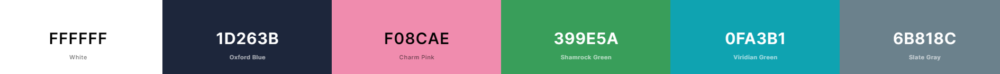

# [abaiik.github.io](https://abaiik.github.io) - v1.0

This is the source code for my personal website - a developer and others.

## Table of Contents

- [Design](#design)
- [Fonts](#fonts)
- [Color Scheme](#color-scheme)
- [Icon](#icon)
- [Wireframes](#wireframes)
- [Built With](#built-with)
- [Creator / Maintainer](#creator-maintainer)
- [Acknowledgments](#acknowledgments)

---

### Color Scheme

- White - all normal text color
- Oxford Blue - page background color, text color on white background
- Charm Pink - links, nav bar item hover, icon hover color
- Shamrock Green - Charm Pink links hover color
- Viridian Green - project skill text color
- Slate Gray - mobile navbar background color

### Icon

This is the icon of me in [abaiik.github.io/about](https://abaiik.github.io/about)

---

## Built With

- 💙 [HTML5](https://www.w3schools.com/html/)
- 💜 [CSS3](https://www.w3schools.com/css/)
- 💙 [JavaScript](https://www.w3schools.com/js/DEFAULT.asp)
- 💜 [Flaticon](https://www.flaticon.com/) and [FontAwesome](https://fontawesome.com/v5.15/icons?d=gallery&p=1) for the icons
- 💙 [Google Domains](https://domains.google/) for the cool domain
- 💜 [Netlify](https://www.netlify.com/) for hosting
- 💙 [Figma](https://www.figma.com/) for design and prototyping tools

---

### Creator / Maintainer

- [`Abaiik`](https://github.com/abaiik/)

- [`Annie Wu`](https://github.com/anniedotexe)

If you have any questions, comments, or concerns, feel free to contact me below.

  

### License

# Copyright &copy; 2021 Abaiik. All rights reserved.
